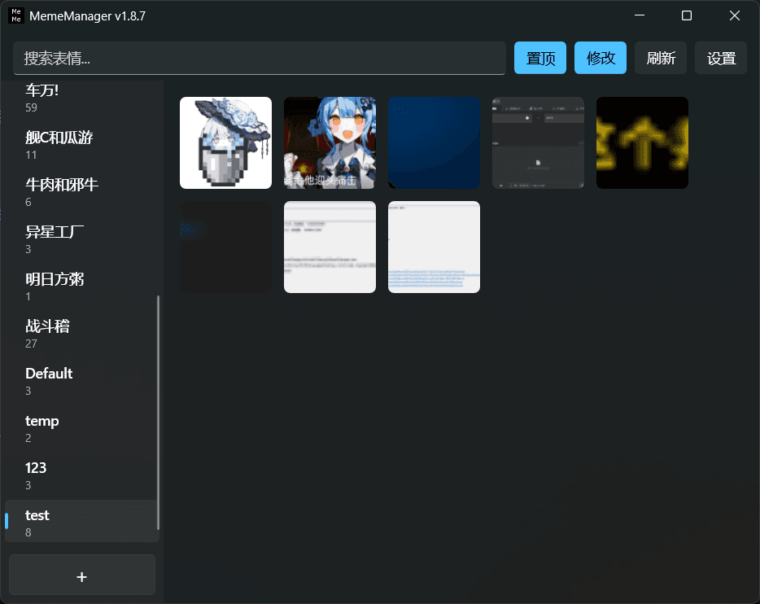
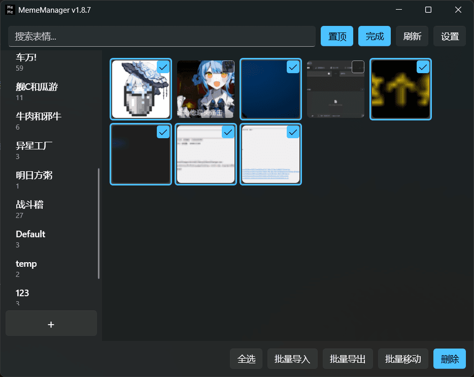

<div align="center">

English | [中文](./README.md)

# MemeManager


A high-performance tool for managing and using your meme/sticker collection, built with `dotnet 10` + `WinUI 3`.

</div>






## Features

- **Extreme drag & drop support**: Both category controls and image controls support drag & drop, including batch drag-to-import, batch multi-select editing, reordering (requires edit mode), and re-categorizing — enjoy intuitive drag behaviors to organize your categories and memes.
- **Smooth preview popup**: Hover over an image to pop up a large preview with its title, so you can see the meme content at a glance.
- **Powerful import performance**: The extreme async I/O performance of dotnet 10 and the excellent rendering of WinUI 3 deliver a smooth experience and animations; you can import 1000 images instantly (depending on disk performance).
- **Minimal background footprint**: After the main window is closed, most controls are released. The background thread consumes virtually zero CPU/GPU; with the main window closed long-term, the private working set stays under ~30 MB.
- **Keyboard shortcut support**: As many common Windows shortcuts as possible are supported, aiming to provide a Windows Explorer-style shortcut experience. See [Keyboard Shortcuts](#keyboard-shortcuts) below for details.
- **Mini mode**: A `334x117` mini window that takes little screen space while still offering basic importing and usage of memes. See [Mini Mode](#mini-mode) below for details.

## User Guide

### First Install

1. Go to the [Release](https://github.com/shuiping233/MemeManager/releases) page and download the latest version. The installer with `runtime` bundles the runtime; the one without `runtime` is recommended.
2. After extracting the archive, run `MemeManager.exe`. The app depends on the [`Windows App Runtime`](https://learn.microsoft.com/windows/apps/windows-app-sdk/downloads) and the [`.NET 10 Desktop Runtime`](https://dotnet.microsoft.com/download/dotnet/10.0). You need to install these runtimes. Alternatively, just run the program — it will show an error dialog that redirects you to the download page for the missing dependency.

### Import / Export Images

- Ways to import images:
  - Drag multiple images into the main window (imports into the current category).
  - Clipboard `Ctrl`+`V`.
  - Batch import in edit mode.
- Ways to export images:
  - Drag a single image to File Explorer or another app (as a file).
  - Batch export the current category's images.

### Categories

Right-click the category bar on the left of the main window to see the `Create new category` option, or use the `+` button at the bottom of the category bar. Category controls themselves can be dragged to reorder.

### Import / Export / Send Images

To send an image, you can click the image directly to send it, or drag the image into a text box to send it (due to WinUI 3 framework stability issues, drag-to-send/export is disabled by default — enable the `StorageFile drag support (drag out as file)` feature with caution).

When sending by clicking the image, the input cursor must already be focused in the target text box, otherwise it won't send (the mechanism copies the image to the clipboard and then performs `Ctrl+V` automatically). You can also right-click an image and choose `Copy` to copy it to the clipboard, then paste it into the target text box yourself.

Right-clicking an image lets you `Open` (open with the system default image viewer), `Rename`, `Move to new category`, and `Delete`. In edit mode you can also multi-select images for batch `Move to new category` and `Delete`. Whether or not you are in edit mode, you can drag an image directly onto a specific category in the left bar to move it to another category.

Hover over an image to pop up a large preview with its title; right-clicking or closing the window cancels the preview.

Renaming an image does not actually change the file name on disk; instead it modifies the `Title` field of the corresponding image item in the `.metadata.json` of that category. The main window search box does a fuzzy search on the image `Title` field, and the preview popup also shows the image `Title`.

> [!TIP]
> The imported image's `Title` field is the file name itself, while the actual file name saved in the data directory is the file's `sha256` + `file extension`.

### Edit Mode

Click the `Edit` button or press `Ctrl`+`E` to enter edit mode.

You can also quickly enter edit mode in non-edit mode by holding `Shift` + `Left Click` on an image, `Ctrl`+`A` to select all, or via the image right-click menu `Multi-select`.

In edit mode, `Esc` exits edit mode quickly.

In edit mode you can multi-select images to operate on, and drag & drop is still supported. After multi-selecting, dragging performs batch reordering: drag the selected images to a new position and they are inserted there automatically (due to WinUI 3's control drag characteristics, the drag anchor can only recognize the first and last of the multi-selected controls — in plain terms, if the dragged image is near the start of the batch, insertion uses the first image as the reference; otherwise the last image is used).

After multi-selecting, you can also drag the selected images directly onto a category in the left bar to move the whole batch to a new category.

In edit mode, the bottom shows `Select all`, `Batch import`, `Batch export`, `Batch move`, and `Delete` buttons — their functions are exactly as named.

Edit mode supports `Ctrl` to invert selection and `Shift` for batch multi-select. You can enable or disable `Explorer-style multi-select mode` in Settings to change the multi-select behavior.

You can also use `Ctrl`+`A` to select all or invert all images.

### Search Box

Performs a fuzzy search on the image `Title`, limited to the current category. Use the `Ctrl`+`F` shortcut to focus the search box quickly.

### Settings

The settings items are self-explanatory, so we won't repeat them here.

The settings page supports `Esc` to exit and `Enter` to apply configuration.

All configuration is saved in `%LOCALAPPDATA%/MemeManager/config.json`. Imported images and logs are saved in the specified data directory, whose default is `%USERPROFILE%/Pictures/MeMeManagerData`.

## Keyboard Shortcuts

- Global summon shortcut: default `Ctrl`+`Shift`+`.`, customizable to other shortcuts.

- In-main-window shortcuts:
  - `Ctrl`+`F` : focus search box
  - `Ctrl`+`E` : enter/exit edit mode
  - `Ctrl`+`V` : after copying an image, paste it into the current category in the main window
  - `Ctrl`+`N` : create new category
  - `Ctrl`+`A` : select all images; in non-edit mode this enters edit mode and selects all images in the current category
  - `F5` : refresh page (due to control-reuse implementation, no refresh animation shows if content is unchanged)
  - `F2` : rename the current category
  - `Delete` : delete the current category; in edit mode, delete the selected images.

## Mini Mode

In Mini mode, the main window is forced to stay on top, providing basic image drag-to-import capability and an "emoji popup" feature similar to regular chat apps. Clicking the "Emoji" button pops up the "emoji popup", where you can send a meme by clicking or dragging the image.

Apart from the global summon shortcut, no other shortcuts are currently supported in this mode.

> [!TIP]
> The button area in Mini mode is the window title bar; click and drag with the mouse to move the window (even if you click and drag on a button).

## Single-Instance Enforcement

The app already implements the behavior where launching it a second time notifies the existing process to show its main window.

The principle: on each launch the program writes its `HWND` and `PID` to `%LOCALAPPDATA%/MemeManager/instance.lock` so that a later second launch knows which `HWND` to send the "show main window" notification to. The program then uses a **named Mutex provided by Windows** to determine whether another instance is already running. When the second launch detects an existing instance, it immediately reads `instance.lock` to obtain the target old process's `HWND` and `PID`, **registers a cross-process unique message ID with RegisterWindowMessageW** and sends it to the already-running old process, then silently exits regardless of whether the old process received it. The old process, upon receiving the message, proactively shows its main window, completing the whole flow.

## Data Directory Structure

Inside the data directory there is a `.metadata.json` recording the priority of categories.

Each `category` is a folder name containing the category's images and the per-image metadata, i.e. `.metadata.json`.

Imported image files are copied into the data directory and renamed to `sha256` + `file extension`.

The `log` directory holds runtime logs named `debug.log`; once the log exceeds 5 MB it is automatically cleared and then written again. Logs are only saved if the save-log feature is enabled. `crash.log` is a special log produced after a crash.

```
├── .metadata.json
├── Default
│   ├── .metadata.json
│   ├── 34c03106eddb4f358348e234cb1860a690d2a78769927292cac05b018b1331cf.jpg
│   └── ffef5d8cc2467225014781964100beb122acca20afcd40ead270c1a76b0b1ede.png
├── log
│   ├── crash.log
│   └── debug.log
└── test
    ├── .metadata.json
    ├── 25a1afb13214ef965f5c086f3daa6ff75d16287824075331cb6bdd1a47dccf9c.gif
    └── fa779d7d485fae8366d53e102ded5258131378eb02b95175c813b018748a570c.jpg
```

## Building from Source

For setting up the development environment, refer to the official Microsoft documentation: [WinUI3 app development (Visual Studio)](https://learn.microsoft.com/windows/apps/get-started/start-here?tabs=visual-studio).

Simply open `MemeManager.sln` at the repository root with Visual Studio to build and run.

### Internationalization (i18n)

The app's languages are driven by resource files under `Strings/`. For details on adding or maintaining languages, see [Strings/README.md](Strings/README.md) (Chinese version: [Strings/README.zh-CN.md](Strings/README.zh-CN.md)).

## Acknowledgements

- [NightSkyTS] : Tester — provided a Windows 10 test machine and contributed and reported more than half of the bugs and optimization suggestions.

- [BigJ-00] : Tester — suggested the Mini mode and provided its UI draft.

- Similar projects
  - [SuzuEmojy] : An excellent similar project, a meme manager based on Python3 and Qt6.
  - [OhMyMeme] : An excellent similar project, a meme manager based on Python3 and Webview2, which can import memes from chat apps like QQ/WeChat with one click, and supports saving and syncing memes to cloud storage services.
  - [StickersManager2] : An excellent similar project, a meme manager based on C++20 and QT6.
  - [MSearcher] : An earlier similar project, a meme manager based on Electron, "quickly organize and search your meme images or stickers", supports OCR renaming.
  - [EmoKit] : An excellent similar project, a meme manager based on Python3, Qt5 and QFluentWidgets.
  - [EmoticonTool] : A similar project, a meme manager based on Python3 and Qt6, "supports global hotkey summon, hover preview, and usage frequency statistics".
  - [EmojiManager] : A similar project, a meme manager based on dotnet8 and webview2, "a local meme manager tool used with QQNT".
  - [emoji-manager] : A closed-source similar project with unknown architecture information, "a meme manager on Windows".
  - [astrbot_plugin_meme_manager] : An excellent [Astrbot] plugin, "a powerful AstrBot meme management plugin, supporting 🤖 AI smart send & auto-collect memes, 🖥️ WebUI management interface, ☁️ cloud sync and more."
  - [astrbot_plugin_smart_imagechat_hub] : An excellent [Astrbot] plugin, "an LLM-driven all-in-one smart image chat plugin for AstrBot"

[NightSkyTS]: https://github.com/NightSkyTS
[BigJ-00]: https://github.com/BigJ-00
[SuzuEmojy]: https://github.com/IxinorTyan/SuzuEmojy
[StickersManager2]: https://github.com/igugyj/StickersManager2
[OhMyMeme]: https://github.com/TNTXZ/OhMyMeme
[MSearcher]: https://github.com/Jacken-Wu/MSearcher
[Astrbot]: https://github.com/AstrBotDevs/Astrbot
[astrbot_plugin_smart_imagechat_hub]: https://github.com/QingchenWait/astrbot_plugin_smart_imagechat_hub
[astrbot_plugin_meme_manager]: https://github.com/anka-afk/astrbot_plugin_meme_manager
[EmoKit]: https://github.com/sxu79r/EmoKit
[EmoticonTool]: https://github.com/xcsbhjz/EmoticonTool
[emoji-manager]: https://github.com/morinoyuki/emoji-manager-releases
[EmojiManager]: https://github.com/Natsukage/EmojiManager
