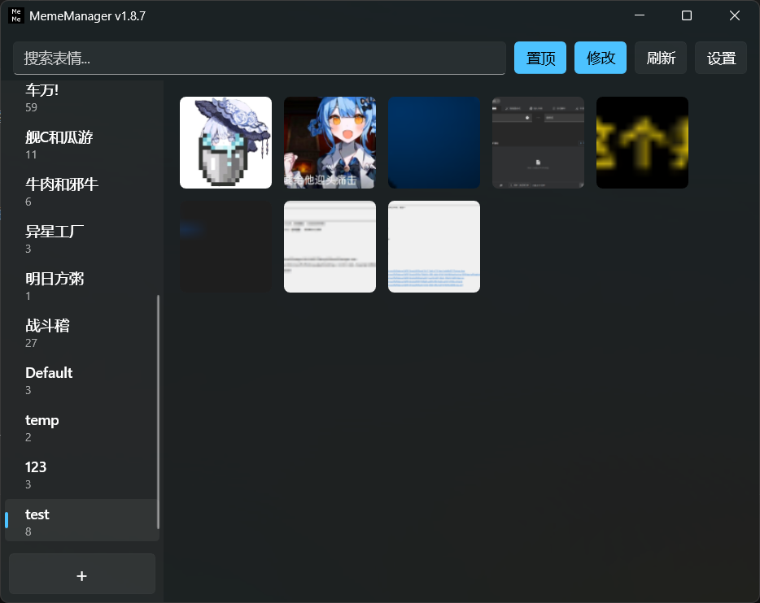
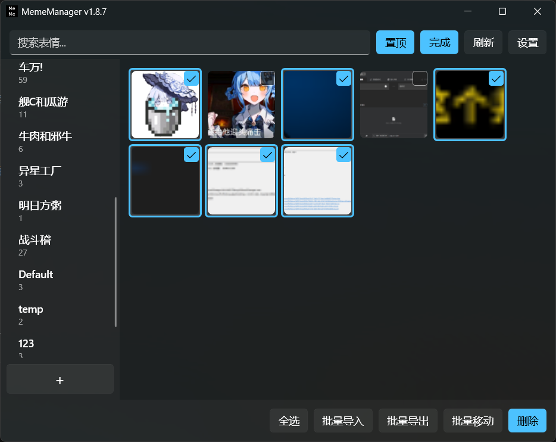
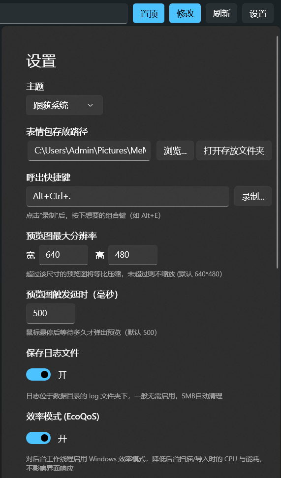
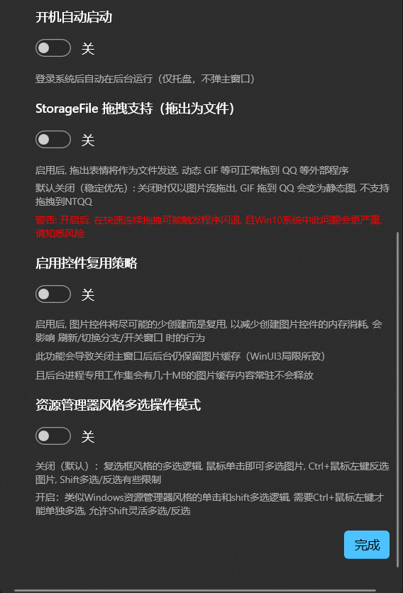

<div align="center">

# MemeManager (表情包管理器)


这是一款高效管理和使用表情包的管理工具, 基于`dotnet10` + `WinUI3`开发

</div>








## 功能特性

- 分类控件和图片控件均支持拖拽, 支持批量拖拽导入图片和批量多选编辑、重排序（重排序需要进入编辑模式）和图片重分类, 可尽情使用符合直觉的拖拽行为管理你的分类和表情包
- 鼠标悬停图片上即可浮窗大图预览图片与标题, 一眼即可看清表情包内容
- dotnet10极致的异步IO性能和优异的WinUI3渲染性提供丝滑的操作体验和动画效果, 可以流畅的导入千张图片（取决于硬盘性能）
- 主窗口关闭后释放大部分控件, 常驻后台线程绝不占用一丁点CPU和GPU性能, 长期关闭主窗口后仅最多30MB不到的专用工作集内存占用


## 使用指南

### 初次安装

1. 去本仓库的[Release](https://github.com/shuiping233/MemeManager/releases)页面下载最新版本, 带`runtime`的安装包中包含运行时, 此处推荐无`runtime`的安装包, 

2. 解压压缩包后, 运行`MemeManager.exe`即可, 由于软件依赖[`Windows App runtime`](https://learn.microsoft.com/zh-cn/windows/apps/windows-app-sdk/downloads)和[`.NET 10 桌面运行时`](https://dotnet.microsoft.com/zh-cn/download/dotnet/10.0), 你需要下载此运行时, 当然你也可以直接运行运行程序, 程序会自动弹窗报错来重定向到你需要下载的依赖下载页面


### 图片导入导出

- 图片导入方式: 
  - 多图片拖拽进入主窗口（导入到当前分类）
  - 剪贴板`Ctrl`+`V`
  - 编辑模式批量导入图片
- 图片导出方式有:
  - 单图片拖拽到资源管理器或其他应用（以文件方式）
  - 批量导出当前分类图片

### 分类

右键主窗口左侧分类分类栏可以看到`创建新分类`选项, 当然也可以通过分类栏底部的`+`按钮创建新分类
分类控件本身可以拖拽重排序

### 图片的导入/导出/发送

要发送图片, 可以直接点击图片以发送图片, 或者拖拽图片到文本框中进行发送（由于WinUI3框架稳定性问题, 拖拽发送/导出图片能力已默认关闭, 请谨慎打开`StorageFile拖拽支持（拖出为文件）`功能）
使用直接点击图片的方式发送图片, 需要输入光标焦点已经在目标输入框中, 否则无法发出（原理是图片拷入剪贴板后自动进行`Ctrl+V`）
也可以在图片右键菜单中点击`复制`选项, 将图片拷贝到剪贴板, 您自行粘贴到目标输入框中发送

邮件图片可以对图片进行`打开`（以系统默认图片查看器打开）, `重命名`, `移动到新分类`和`删除`操作
当然, 在编辑模式下可以多选图片进行批量`移动到新分类`和`删除`的操作
无论是否在编辑模式下, 都可以直接把图片拖至左侧分类栏具体的分类中直接将图片移动到其他分类中

鼠标悬停图片上即可浮窗大图预览图片与标题, 右键和关闭窗口都会取消预览浮窗

重命名图片并不会实际修改保存到硬盘中的文件名, 而是修改位于对应分类文件夹的`.metadata.json`的对应图片Item的`Title`字段, 主窗口搜索框中模糊查询的也是图片的`Title`字段, 图片预览浮窗中也会显示图片的`Title`字段

> [!TIP]  
> 导入的图片的`Title`字段均为文件名本身, 而实际保存到数据目录中的文件名是文件`sha256` + `文件后缀名`


### 编辑模式

点击`修改`按钮或`Ctrl`+`E`即可进入编辑模式

也可以在非编辑模式下, 按住`Shift` + `鼠标左键单击` 图片, `Ctrl`+`A` 全选图片或者图片右键菜单`多选`, 来快速进入编辑模式

进入编辑模式后, `Esc`可以快捷退出编辑模式

编辑模式中, 可以多选图片进行操作, 当然也是继承了可以拖拽的能力的.
多选图片后的拖拽操作, 可以进行图片的批量重排序, 直接将选中的图片拖至新的图片位置, 会自动把这批选中的图片插入到新的位置（由于WinUI3的控件拖拽特性原因, 拖拽图片的锚点只能识别到多选控件的首个和最后一个, 翻译成人话就是如果拖拽的图片靠近批次的首个, 则以首个图片为准插入到目标新位置, 反之则最后一个图片插入到目标新位置）

多选图片后也可以直接拖拽选中的图片到左侧分类栏中, 即可把一批图片移动到新分类中

进入编辑模式后, 下方会出现 `全选`, `批量导入`, `批量导出`, `批量移动`, `删除` 按钮, 功能就如字面意思此啰嗦了

编辑模式支持`Ctrl`反选和`Shift`批量多选, 可以在设置页面中打开或关闭`资源管理器风格多选操作模式`来改变多选操作模式

也可以使用`Ctrl`+`A`全选和全反选图片


### 搜索表情输入框

根据图片的`Title`进行模糊查询, 是只查询当前分类的图片`Title`
可以使用`Ctrl`+`F`快捷键来快速使用搜索框


### 设置

设置中设置项均简单易懂, 此处不再啰嗦

设置页面支持 `Esc` 退出和 `Enter`应用配置快捷键

设置中的配置项内容均保存在`%LOCALAPPDATA%/MemeManager/config.json`
导入的图片和日志均保存在指定的数据目录中, 默认数据目录是`%USERPROFILE%/Pictures/MeMeManagerData`


## 快捷键

- 全局呼出快捷键 : 默认`Ctrl`+`Shift`+`.`, 可自定义成其他快捷键

- 主窗口内部快捷键
  - `Ctrl`+`F` : 搜索框快捷键
  - `Ctrl`+`E` : 进入/退出编辑模式
  - `Ctrl`+`V` : 复制图片后可以在主窗口使用粘贴快捷键插入图片到当前分类
  - `Ctrl`+`N` : 新建分类
  - `Ctrl`+`A` : 全选图片, 非编辑模式下使用会进入编辑模式且全选当前分类的图片
  - `Ctrl`+`C` : 复制当前导航焦点选中的图片到剪贴板
  - `F5` : 刷新页面（由于控件重用相关的实现, 刷新页面后无内容变化则不会有刷新的动画效果）
  - `F2` : 重命名当前分类名称
  - `↑/↓/←/→`方向键 : 切换图片的导航焦点
  - `Ctrl`+`↑/↓`方向键 : 切换分类
  - `Delete` : 删除当前焦点图片
  - `Ctrl`+`Delete` : 删除当前分类
  


## 禁止多开

已经实现二次启动软件后, 会通知旧进程呼出主窗口的功能了

原理是每次程序启动后将`HWND`和`PID`写入到`%LOCALAPPDATA%/MemeManager/instance.lock`以让后面二次启动的程序直到要把呼出主窗口的通知发到哪个`HWND`上, 然后程序通过**Windows 提供的命名互斥体 Mutex**来实现进程是否多开的判断, 当二次启动的进程发现已经开过一个进程后, 立刻读取`instance.lock`获得目标旧进程的`HWND`和`PID`, **用 RegisterWindowMessageW 注册一个跨进程唯一消息 ID**发给已启动的旧进程, 然后不管旧进程是否收到, 立刻静默退出, 旧进程收到消息后自己主动呼出主窗口, 完成整个流程


## 数据目录结构

数据目录内有一个`.metadata.json`, 用于记录分类的优先级

`分类`将作为文件夹名称, 里边存放各分类的图片和分类内图片的元数据信息, 也就是`.metadata.json`

图片文件在导入是均拷贝到数据目录, 且重命名为`sha256` + `文件后缀名`

`log`目录保存程序运行时产生的日志, 文件名为`debug.log`, 日志大小超过5MB之后自动清空后再写入, 不开启保存日志功能是不会保存日志的, `crash.log`是程序崩溃后会产生的特殊的日志

```
├── .metadata.json
├── Default
│   ├── .metadata.json
│   ├── 34c03106eddb4f358348e234cb1860a690d2a78769927292cac05b018b1331cf.jpg
│   └── ffef5d8cc2467225014781964100beb122acca20afcd40ead270c1a76b0b1ede.png
├── log
│   ├── crash.log
│   └── debug.log
└── test
    ├── .metadata.json
    ├── 25a1afb13214ef965f5c086f3daa6ff75d16287824075331cb6bdd1a47dccf9c.gif
    └── fa779d7d485fae8366d53e102ded5258131378eb02b95175c813b018748a570c.jpg
```

## 鸣谢
- [NightSkyTS] : 测试人员, 提供了win10测试机器, 提供和反馈了超过半数Bug和优化建议

- [SuzuEmojy] : 优秀的同类项目, 基于Python和Qt开发的表情管理器


[NightSkyTS]: https://github.com/NightSkyTS
[SuzuEmojy]: https://github.com/IxinorTyan/SuzuEmojy