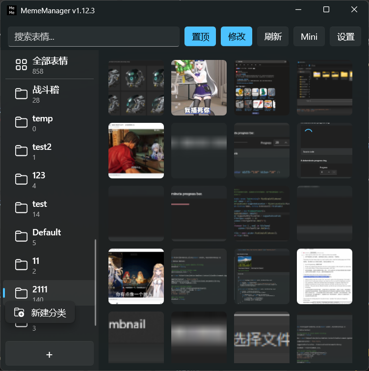
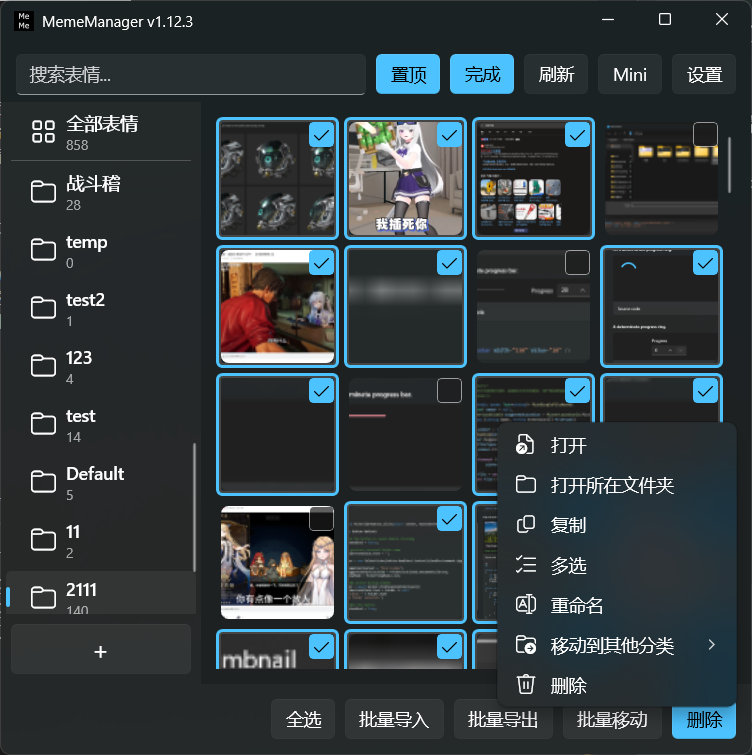
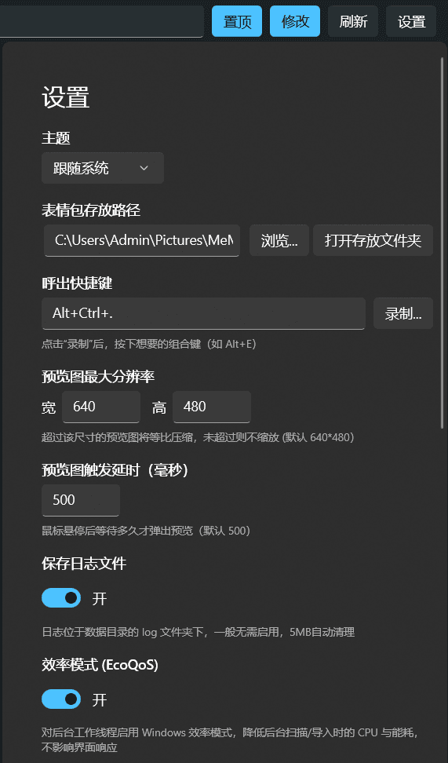
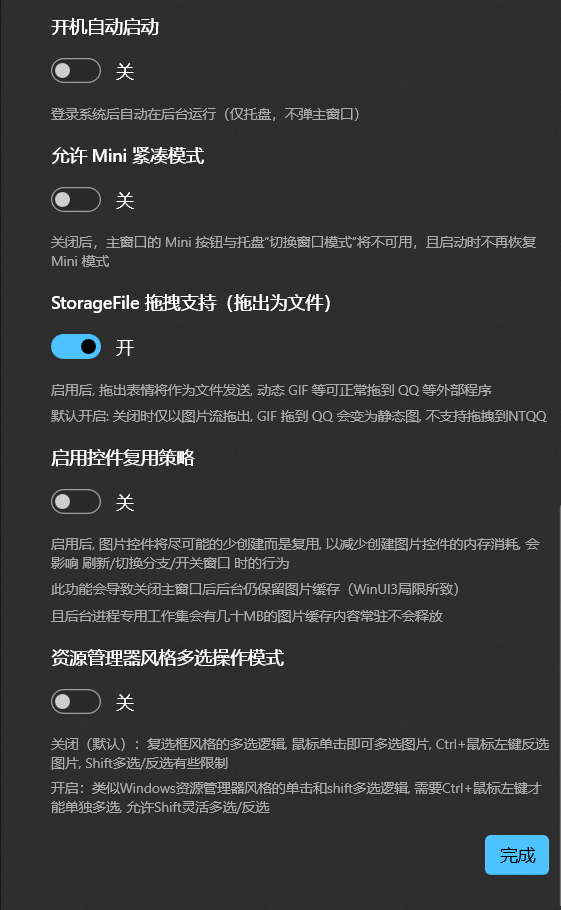

<div align="center">

[English](./README.en.md) | 中文

# MemeManager (表情包管理器)

<a href="https://github.com/shuiping233/MemeManager/releases/latest">
  
</a>


这是一款高效管理和使用表情包的管理工具, 基于`dotnet10` + `WinUI3`开发

</div>

  
  
  
  
  
  
  
  

## 功能特性

- **极致的拖拽支持**: 分类控件和图片控件均支持拖拽, 支持批量拖拽导入图片和批量多选编辑、重排序和图片重分类, 可尽情使用符合直觉的拖拽行为管理你的分类和表情包
- **流畅的预览浮窗**: 鼠标悬停图片上即可浮窗大图预览图片与标题, 一眼即可看清表情包内容
- **强大的导入性能**: dotnet10极致的异步IO性能和优异的WinUI3渲染性提供丝滑的操作体验和动画效果, 可以瞬间的导入1000张图片（取决于硬盘性能）
- **尽可能小的后台占用**: 主窗口关闭后释放大部分控件, 常驻后台线程绝不占用一丁点CPU和GPU性能, 关闭主窗口后会尽量释放可以释放的资源以及内存, 受限于WinUI3框架限制, 已经尽量优化到后台进制占用平均200mb左右的专用工作集内存占用
- **快捷键支持**: 已经尽可能多的支持windows常用快捷键, 目标是能提供windows资源管理器风格的快捷键体验, 具体请参见下文 [快捷键](#快捷键) 的详细描述
- **Mini模式**: `334x117`的mini小窗口, 既不会占用过多屏幕空间, 也能拥有基础的导入和使用表情包的操作体验, 具体请见下文 [Mini模式](#Mini模式) 的详细描述

## 使用指南

### 初次安装

1. 去本仓库的[CNB仓库高速Release下载](https://cnb.cool/shuiping233/MemeManager/-/releases)/[Release](https://github.com/shuiping233/MemeManager/releases)页面下载最新版本, 带`runtime`的安装包中包含运行时, 此处推荐无`runtime`的安装包,

2. 解压压缩包后, 运行`MemeManager.exe`即可, 由于软件依赖[`Windows App runtime`](https://learn.microsoft.com/zh-cn/windows/apps/windows-app-sdk/downloads)和[`.NET 10 桌面运行时`](https://dotnet.microsoft.com/zh-cn/download/dotnet/10.0), 你需要下载此运行时, 当然你也可以直接运行运行程序, 程序会自动弹窗报错来重定向到你需要下载的依赖下载页面

### 图片导入导出

- 图片导入方式:
  - 多图片拖拽进入主窗口（导入到当前分类）
  - 剪贴板`Ctrl`+`V`
  - 编辑模式批量导入图片
- 图片导出方式有:
  - 单图片拖拽到资源管理器或其他应用（以文件方式）
  - 批量导出当前分类图片

### 分类

右键主窗口左侧分类分类栏可以看到`创建新分类`选项, 当然也可以通过分类栏底部的`+`按钮创建新分类
分类控件本身可以拖拽重排序

### 图片的导入/导出/发送

要发送图片, 可以直接点击图片以发送图片, 或者拖拽图片到文本框中进行发送（需要在设置中启用`StorageFile拖拽支持`）

使用直接点击图片的方式发送图片, 需要输入光标焦点已经在目标输入框中, 否则无法发出（原理是图片拷入剪贴板后自动进行`Ctrl+V`）

也可以在图片右键菜单中点击`复制`选项, 将图片拷贝到剪贴板, 您自行粘贴到目标输入框中发送

鼠标右键点击图片展开操作列表，可对图片进行`打开`（以系统默认图片查看器打开）, `重命名`, `移动到新分类`和`删除`操作

当然, 在编辑模式下可以多选图片进行批量`移动到新分类`和`删除`的操作

无论是否在编辑模式下, 都可以直接把图片拖至左侧分类栏具体的分类中直接将图片移动到其他分类中

鼠标悬停图片上即可浮窗大图预览图片与标题, 右键和关闭窗口都会取消预览浮窗

重命名图片并不会实际修改保存到硬盘中的文件名, 而是修改位于对应分类文件夹的`.metadata.json`的对应图片Item的`Title`字段, 主窗口搜索框中模糊查询的也是图片的`Title`字段, 图片预览浮窗中也会显示图片的`Title`字段

> [!TIP]  
> 导入的图片的`Title`字段均为文件名本身, 而实际保存到数据目录中的文件名是文件`sha256` + `文件后缀名`

### 编辑模式

点击`修改`按钮或`Ctrl`+`E`即可进入编辑模式

也可以在非编辑模式下, 按住`Shift` + `鼠标左键单击` 图片, `Ctrl`+`A` 全选图片或者图片右键菜单`多选`, 来快速进入编辑模式

进入编辑模式后, `Esc`可以快捷退出编辑模式

编辑模式中, 可以多选图片进行操作, 当然也是继承了可以拖拽的能力的

多选图片后的拖拽操作, 可以进行图片的批量重排序, 直接将选中的图片拖至新的图片位置, 会自动把这批选中的图片插入到新的位置（由于WinUI3的控件拖拽特性原因, 拖拽图片的锚点只能识别到多选控件的首个和最后一个, 翻译成人话就是如果拖拽的图片靠近批次的首个, 则以首个图片为准插入到目标新位置, 反之则最后一个图片插入到目标新位置）

多选图片后也可以直接拖拽选中的图片到左侧分类栏中, 即可把一批图片移动到新分类中

进入编辑模式后, 下方会出现 `全选`, `批量导入`, `批量导出`, `批量移动`, `删除` 按钮, 功能就如字面意思此啰嗦了

编辑模式支持`Ctrl`反选和`Shift`批量多选, 可以在设置页面中打开或关闭`资源管理器风格多选操作模式`来改变多选操作模式

也可以使用`Ctrl`+`A`全选和全反选图片

编辑模式下`Delete`则是删除选中的图片, 未选中图片则不响应此按键

### 搜索表情输入框

根据图片的`Title`进行模糊查询, 是只查询当前分类的图片`Title`
可以使用`Ctrl`+`F`快捷键来快速使用搜索框

### 设置

设置中设置项均简单易懂, 此处不再啰嗦

设置页面支持 `Esc` 退出和 `Enter`应用配置快捷键

设置中的配置项内容均保存在`%LOCALAPPDATA%/MemeManager/config.json`
导入的图片和日志均保存在指定的数据目录中, 默认数据目录是`%USERPROFILE%/Pictures/MeMeManagerData`

## 快捷键

- 全局呼出快捷键 : 默认`Ctrl`+`Shift`+`.`, 可自定义成其他快捷键

- 主窗口内部快捷键
  - `Ctrl`+`F` : 搜索框快捷键
  - `Ctrl`+`E` : 进入/退出编辑模式
  - `Ctrl`+`V` : 复制图片后可以在主窗口使用粘贴快捷键插入图片到当前分类
  - `Ctrl`+`N` : 新建分类
  - `Ctrl`+`A` : 全选图片, 非编辑模式下使用会进入编辑模式且全选当前分类的图片
  - `F5` : 刷新页面（若打开了`启用控件复用策略`, 因为控件重用相关的实现, 刷新页面后无内容变化则不会有刷新的动画效果）
  - `F2` : 重命名当前分类名称
  - `Delete` : 删除当前分类, 编辑模式时则是删除选中的图片

## Mini模式

Mini模式时, 主窗口置顶状态跟随Full模式的置顶状态, 提供基础的图片拖拽导入能力, 以及类似常规聊天应用的"表情浮窗"功能, 点击"表情"按钮时可以弹出"表情浮窗", 可以用点击图片或拖拽图片的方式发送表情

此模式除全局呼出快捷键外, 暂不支持其他快捷键

> [!TIP]
> Mini模式的按钮部分即为窗口标题栏, 鼠标单击拖拽即可移动窗口(即使单击拖拽在按钮上也是可以的)

## 多开唤起主窗口

已经实现二次启动软件后, 会通知旧进程呼出主窗口的功能了

原理是每次程序启动后将`HWND`和`PID`写入到`%LOCALAPPDATA%/MemeManager/instance.lock`以让后面二次启动的程序直到要把呼出主窗口的通知发到哪个`HWND`上, 然后程序通过**Windows 提供的命名互斥体 Mutex**来实现进程是否多开的判断, 当二次启动的进程发现已经开过一个进程后, 立刻读取`instance.lock`获得目标旧进程的`HWND`和`PID`, **用 RegisterWindowMessageW 注册一个跨进程唯一消息 ID**发给已启动的旧进程, 然后不管旧进程是否收到, 立刻静默退出, 旧进程收到消息后自己主动呼出主窗口, 完成整个流程

## 数据目录结构

数据目录内有一个`.metadata.json`, 用于记录分类的优先级

`分类`将作为文件夹名称, 里边存放各分类的图片和分类内图片的元数据信息, 也就是`.metadata.json`

图片文件在导入是均拷贝到数据目录, 且重命名为`sha256` + `文件后缀名`

`log`目录保存程序运行时产生的日志, 文件名为`debug.log`, 日志大小超过5MB之后自动清空后再写入, 不开启保存日志功能是不会保存日志的, `crash.log`是程序崩溃后会产生的特殊的日志

```text
├── .metadata.json
├── Default
│   ├── .metadata.json
│   ├── 34c03106eddb4f358348e234cb1860a690d2a78769927292cac05b018b1331cf.jpg
│   └── ffef5d8cc2467225014781964100beb122acca20afcd40ead270c1a76b0b1ede.png
├── log
│   ├── crash.log
│   └── debug.log
└── test
    ├── .metadata.json
    ├── 25a1afb13214ef965f5c086f3daa6ff75d16287824075331cb6bdd1a47dccf9c.gif
    └── fa779d7d485fae8366d53e102ded5258131378eb02b95175c813b018748a570c.jpg
```

## `.metadata.json`

有两类`.metadata.json`, 一类是用来管理分类的元数据, 位置就在数据目录内, 一类是用来管理图片的元数据, 存放在图片对应的分类文件夹内

- 分类和图片元数据中都有`Priority`, 也就是优先级, 排序规则是是 `higher first`, 也就是数值越大优先级越高, 图片也就越靠前
- 图片元数据中, 还有`Title`就是用户在应用中`重命名`的内容, 也可以理解为图片的别名, 在应用的搜索框查询也是查询的此字段, `Tags`是保留的字段, 目前暂未使用而且也没有实现添加`Tag`的功能

分类元数据结构如下：

```json
{
    "Categories": {
        "猫头鹰": {
            "Priority": 2
        },
        "test": {
            "Priority": 1
        }
    }
}
```

图片元数据结构如下：

```json
{
    "Items": {
        "64e9e9e7a967517f711410628a3c8746906f94985e5989589153030d08bc230e.jpg": {
            "Title": "猫头鹰图片1",
            "Tags": [],
            "Priority": 2
        },
        "e3ebf937c2ddae3376c11db6b31f5c0b5ef2a6c4826faf1f87ed260ae19aedec.webp": {
            "Title": "Snipaste_2026-07-11_16-00-51",
            "Tags": [],
            "Priority": 1
        }
    }
}
```

## 项目开发

开发环境搭建请参考微软官方文档：[WinUI3 应用开发入门（Visual Studio）](https://learn.microsoft.com/zh-cn/windows/apps/get-started/start-here?tabs=visual-studio)。

直接使用 Visual Studio 打开仓库根目录的 `MemeManager.sln` 即可编译运行。

### 国际化 (i18n) 说明

本程序的语言支持由 `Strings/` 目录下的资源文件驱动，新增/维护语言的详细说明请见 [Strings/README.zh-CN.md](Strings/README.zh-CN.md)（英文版见 [Strings/README.md](Strings/README.md)）。

## 鸣谢

- [NightSkyTS] : 测试人员, 提供了win10测试机器, 提供和反馈了超过半数Bug和优化建议
- [BigJ-00] : 测试人员, 提出Mini模式的建议和ui草稿

- 同类项目
  - [SuzuEmojy] : 同类项目, 基于Python3和Qt6开发的表情管理器, "一个专注于 Windows 的本地表情包管理工具"
  - [OhMyMeme] : 同类项目, 基于Python3和Webview2开发的表情管理器, 可从QQ/微信等聊天应用一键导入表情包, 且支持将表情包保存和同步到网络存储服务中
  - [StickersManager2] : 同类项目, 基于C++20和QT6开发的表情管理器
  - [MSearcher] : 较早期的同类项目, 基于Electron开发的表情管理器, "可以快速地整理和搜索你的 meme 图或表情包", 支持OCR重命名
  - [EmoKit] : 同类项目, 基于Python3和Qt5和QFluentWidgets开发的表情管理器
  - [EmoticonTool] : 同类项目, 基于Python3和Qt6开发的表情管理器, "支持全局快捷键唤出，鼠标悬停预览，使用频率统计等功能"
  - [EmojiManager] : 同类项目, 基于dotnet8和webview2开发的表情管理器, "一个配合QQNT使用的本地表情包管理工具"
  - [emoji-manager] : 闭源的同类项目, 架构信息未知, "Windows上的表情包管理器"
  - [astrbot_plugin_meme_manager] : [Astrbot]插件, "一个功能强大的 AstrBot 表情包管理插件，支持 🤖 AI 智能发送与自动收集表情、🖥️ WebUI 管理界面、☁️ 云端同步等特性。"
  - [astrbot_plugin_smart_imagechat_hub] : [Astrbot]插件, "LLM 驱动的 AstrBot 一体化智能图片对话插件"

[NightSkyTS]: https://github.com/NightSkyTS
[BigJ-00]: https://github.com/BigJ-00
[SuzuEmojy]: https://github.com/IxinorTyan/SuzuEmojy
[StickersManager2]: https://github.com/igugyj/StickersManager2
[OhMyMeme]: https://github.com/TNTXZ/OhMyMeme
[MSearcher]: https://github.com/Jacken-Wu/MSearcher
[Astrbot]: https://github.com/AstrBotDevs/Astrbot
[astrbot_plugin_smart_imagechat_hub]: https://github.com/QingchenWait/astrbot_plugin_smart_imagechat_hub
[astrbot_plugin_meme_manager]: https://github.com/anka-afk/astrbot_plugin_meme_manager
[EmoKit]: https://github.com/sxu79r/EmoKit
[EmoticonTool]: https://github.com/xcsbhjz/EmoticonTool
[emoji-manager]: https://github.com/morinoyuki/emoji-manager-releases
[EmojiManager]: https://github.com/Natsukage/EmojiManager
